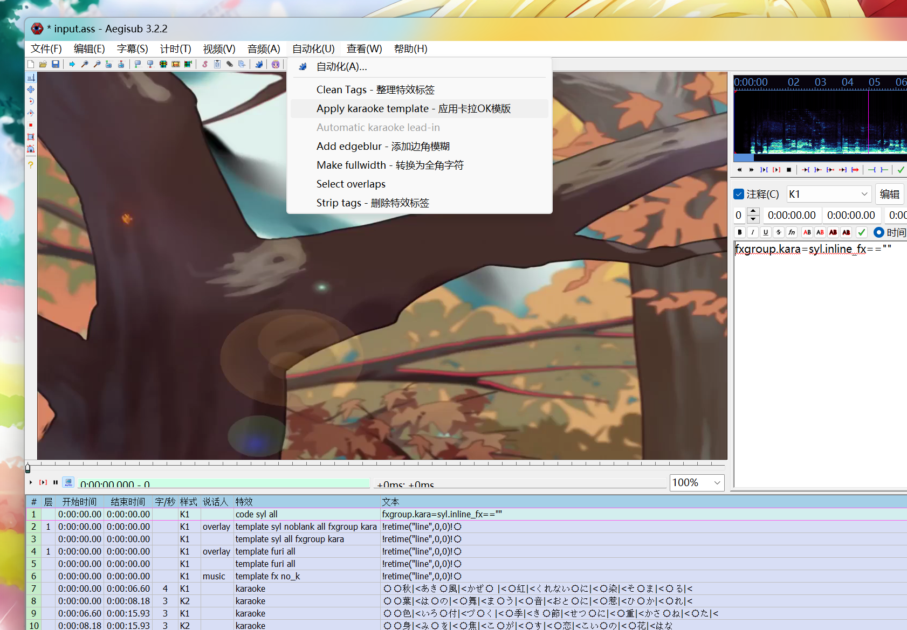

# qrc2ass

A demo covert k-timed qrc to input of Aegisub Karaoke-templater.

## Usage

You can run demo to execute this covert:

1. Install [Node](https://nodejs.org/en/) and [Yarn](https://yarnpkg.com/)([Chinese](http://yarnpkg.top/Installation.html)). 
2. Run `yarn` in the project root directory.
3. Specify QRC file path and other parameters in `index.ts`.
4. Run `yarn start` in the project root directory to perform converting.

You can also use the function `convert` in your own code.

1. Run `yarn i qrc2ass` in your project root directory.
2. Import through `import { convert } from 'qrc2ass';`.

When you have finished converting, you can use Aegisub's `karaoke-templater` plugin to convert it to karaoke subtitle.

Since the default font is [`Noto Serif CJK SC Black`](public/fonts/NotoSerifCJKsc-Black.otf), you need to install it before rendering.



Then you can burn it to hard-subtitle with [ffmpeg](http://ffmpeg.org/) by running:

```shell
# Suppose the video you want as input is in MP4 format.
ffmpeg -i input.mp4 -vf ass=input.ass -vcodec h264_nvenc output.mp4
# If you own an Nvidia graphics card, run this instead.
ffmpeg -i input.mp4 -vf ass=input.ass -vcodec h264_nvenc output.mp4
```

If you are using Windows, get built binaries of ffmpeg from [here](https://www.gyan.dev/ffmpeg/). It is recommended to download the Full build.

## Appendix

Special thanks to [ESLyric](https://github.com/ESLyric)'s qrc decoder algorithm.

### Reference

- [ESLyric](https://github.com/ESLyric)
- [QRCD](https://github.com/xmcp/QRCD)
- [Aegisub](https://github.com/Aegisub/Aegisub)
